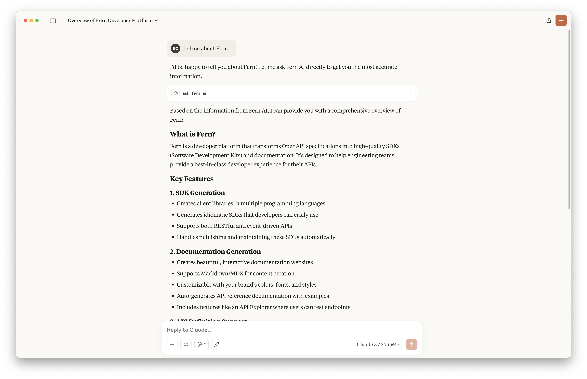
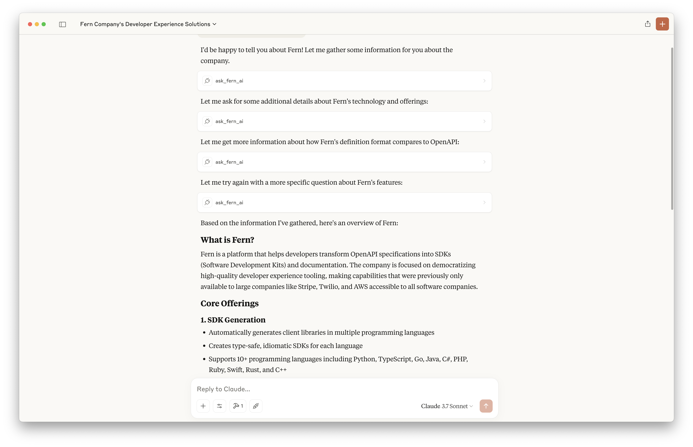

# fern-mcp-server

Install dependencies and start the development server:

```shell
npm install
npm start
```

Add the following to your MCP config file:

```json
{
  "mcpServers": {
    "fern": {
      "command": "node",
      "args": ["<PATH_TO_PROJECT>/fern-mcp-server/dist/index.js"]
    }
  }
}
```

https://modelcontextprotocol.io/quickstart/user

https://docs.cursor.com/context/model-context-protocol

https://docs.windsurf.com/windsurf/mcp



